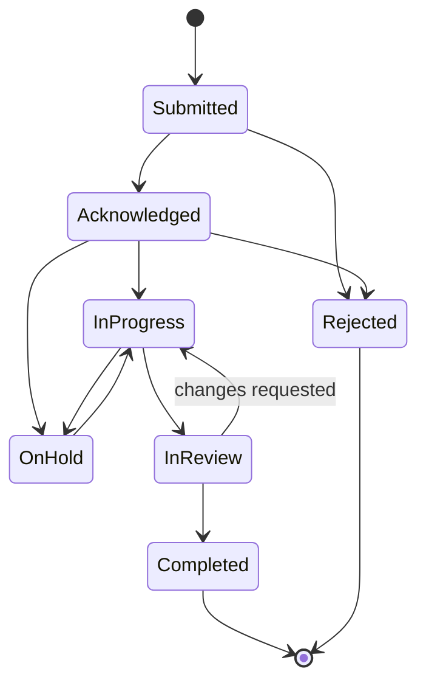
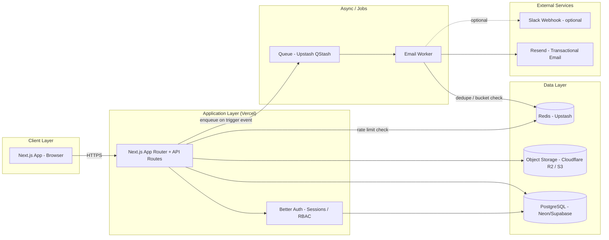

# PRD — Client Change Request Portal
### Working name: **ChangeDesk**

| | |
|---|---|
| **Author** | Sayuj |
| **Status** | Draft v0.1 |
| **Date** | August 15, 2026 |
| **Owner / Primary Admin** | Sayuj (freelance/agency operator) |

---

## 1. Overview

Sayuj runs freelance/agency work across 7–8 Shopify clients (fashion, beauty, e-commerce). Right now, change requests likely come in through WhatsApp, email, and DMs — scattered, hard to track, easy to lose, and impossible to report on.

**ChangeDesk** is a self-serve portal where each client can log in, submit change requests (with screenshots, references, and descriptions) against their store, and track status in real time — replacing ad-hoc chat-based requests with a structured, auditable workflow. Sayuj (and any future team members) manage all client requests from a single admin view.

This is fundamentally a **multi-tenant support/ticketing system**, scoped specifically to Shopify store change management.

---

## 2. Problem Statement

- Change requests arrive through unstructured channels (WhatsApp/Email/Insta DM) → no single source of truth.
- No visibility for the client into what's done, in progress, or pending.
- No audit trail — disputes over "did I ask for this" or "when was this requested."
- Manual status updates cost time; clients ping repeatedly for status.
- As client count grows (7–8 → more), this doesn't scale without structure.

## 3. Goals

- One portal, one workflow, for all clients — regardless of what they're building (Shopify theme, SEO, content).
- Every change request is structured: title, description, screenshot(s), reference, priority, target page.
- Client always knows status without asking.
- Admin (Sayuj / future team) gets a single queue across all clients, filterable and assignable.
- Notifications work reliably without becoming spam (rate-limited, batched intelligently).
- UI feels as familiar and lightweight as the Shopify Admin itself, since clients already live there daily.

### Non-goals (for v1)
- Not a full project management tool (no Gantt charts, no time tracking/billing in v1).
- Not a public status page (internal, authenticated access only).
- Not replacing Shopify's own admin — this sits alongside it, purely for change requests/collaboration.

---

## 4. User Roles & Personas

| Role | Who | Description |
|---|---|---|
| **Super Admin** | Sayuj | Full access — all orgs, all requests, manages team members, configures system settings |
| **Team Member (Admin)** | Future devs/VAs Sayuj hires | Scoped to assigned client orgs; can triage, update status, comment |
| **Client Owner** | Primary contact at client (e.g. Prachi at Studio Caramel) | Manages their org's users, submits/views requests for their org only |
| **Client Member** | Client's team (e.g. their marketing person) | Can submit and view requests for their org; can't manage org users |

### RBAC Permission Matrix

| Action | Super Admin | Team Member | Client Owner | Client Member |
|---|:---:|:---:|:---:|:---:|
| Create/manage client orgs | ✅ | ❌ | ❌ | ❌ |
| Invite/remove users in own org | ✅ (any org) | ❌ | ✅ (own org) | ❌ |
| View requests — all orgs | ✅ | ⚠️ assigned orgs only | ❌ | ❌ |
| View requests — own org | ✅ | ✅ | ✅ | ✅ |
| Create change request | ✅ | ✅ | ✅ | ✅ |
| Edit/delete own request (pre-acknowledged) | ✅ | ✅ | ✅ | ✅ |
| Update request status | ✅ | ✅ (assigned) | ❌ | ❌ |
| Assign request to team member | ✅ | ⚠️ limited | ❌ | ❌ |
| Comment on request | ✅ | ✅ | ✅ | ✅ |
| View org analytics/reports | ✅ | ✅ (assigned) | ✅ (own org) | ❌ |
| Manage notification preferences | ✅ (self) | ✅ (self) | ✅ (self) | ✅ (self) |

RBAC is enforced **server-side on every API route** — never trust client-side role checks alone.

---

## 5. Core Features

### 5.1 Authentication & RBAC
- **Better Auth** as the auth layer — email/password + optional magic link, with its **Organization plugin** mapped to our org/membership model, and **Admin plugin** for the Super Admin/Team Member layer.
- Session-based auth, secure httpOnly cookies, CSRF protection on state-changing routes.
- Invite-based onboarding: Admin invites a client org → client owner sets password via emailed invite link (time-limited token).
- Built-in brute-force protection on login (see Rate Limiting §8).

### 5.2 Admin Dashboard
- Unified queue across all client orgs — filter by client, status, priority, assignee, date range.
- Kanban view (Submitted → Acknowledged → In Progress → In Review → Completed) and List view toggle.
- Bulk actions: assign, change status, tag.
- Per-client detail view: all requests, activity log, contact info, linked Shopify store(s).
- Analytics: average turnaround time, requests per client, completion rate, overdue items.

### 5.3 Client Dashboard
- Scoped strictly to their own org (RBAC-enforced, not just UI-hidden).
- "New Request" as the primary CTA — minimal friction.
- Status board of their own requests, with clear visual status (badges, not jargon).
- Comment thread per request for back-and-forth clarification.

### 5.4 Change Request Submission (client-facing form)
| Field | Type | Notes |
|---|---|---|
| Title | text, required | Short summary |
| Description | rich text, required | What needs to change |
| Type | select | Bug / Content / Design / New Feature / Other |
| Priority | select | Low / Medium / High / Urgent |
| Screenshot(s) | file upload, multiple | Drag-drop, paste-from-clipboard support |
| Reference link | URL, optional | e.g. inspiration site, competitor page |
| Target page/section | text, optional | e.g. "Homepage hero" |
| Store (if multi-store client) | select | Which Shopify store this applies to |

### 5.5 Status Workflow



Every transition is logged to the audit trail with actor, timestamp, and optional note. Status changes are what trigger client-facing email notifications.

### 5.6 Notifications (Email + In-App)
Triggers:
- New request created → notify assigned admin(s) / Super Admin
- Status changed → notify request creator + org (if opted in)
- Comment added → notify the other party in the thread
- Assignment changed → notify new assignee

In-app notification bell (read/unread) mirrors every email, so nothing is lost even if email is rate-limited or digested (see §8).

### 5.7 Comments & Collaboration
- Threaded comments per request — this is often where "spec drift" gets caught before dev work starts.
- @mentions for team members.
- File re-attachment inside comments (e.g. "here's the revised screenshot").

### 5.8 Additional Recommended Features
These aren't in your original list but fit naturally and are low-cost to add now, expensive to bolt on later:

- **Multi-store support per org** — some clients may run more than one Shopify store.
- **Client branding on their portal view** — their logo, subtle — makes it feel like *their* portal, not generic SaaS.
- **Monthly PDF/CSV export per client** — you already generate branded PDF reports for clients (SEO reports); reuse that pattern here for a "changes completed this month" report. Strong upsell/retention artifact.
- **Slack/Discord webhook for new requests** — since you're solo today, a instant ping matters more than checking a dashboard.
- **SLA flagging** — auto-flag requests open >X days with no status change, surfaced on the admin dashboard.
- **Tags/labels** — beyond type/priority, freeform tags (e.g. "homepage", "checkout") for filtering at scale.
- **Notification digest preferences** — instant / hourly / daily, per user (ties directly into rate limiting).
- **Screenshot annotation (stretch goal, v2)** — basic arrow/box markup on uploaded screenshots, since "this button, right here" is 90% of design feedback.

---

## 6. System Architecture



### 6.1 Recommended Tech Stack

| Layer | Choice | Why |
|---|---|---|
| Frontend framework | Next.js 15 (App Router) + TypeScript | Matches your existing stack |
| UI components | **Shopify Polaris** (React) + Tailwind for layout | Gives you Shopify-admin-native look for free — light, minimal, professional out of the box |
| Auth | **Better Auth** (Organization + Admin plugins) | TypeScript-native, RBAC via org/member roles, self-hosted (no vendor lock-in) |
| Database | PostgreSQL (Neon or Supabase) | Relational fit for orgs/roles/requests; generous free tier |
| ORM | Drizzle or Prisma | Either fits Next.js well; Drizzle is lighter if you want SQL-close control |
| File storage | Cloudflare R2 (S3-compatible, no egress fees) | Cheapest for screenshot-heavy usage across many clients |
| Email | Resend + React Email templates | Clean DX, good deliverability, simple rate/queue integration |
| Queue / async jobs | Upstash QStash (serverless-friendly) | Fits Vercel deployment without needing a persistent worker process |
| Rate limiting | Upstash Ratelimit (Redis-backed) | Sliding-window limiter, works serverless |
| Hosting | Vercel | Matches Next.js, zero-config CI/CD |
| Monitoring | Sentry + Vercel Analytics | Error tracking + basic usage metrics |

> Note: Better Auth's plugin APIs move fast — verify exact plugin names/config against current docs at implementation time rather than treating this PRD as the source of truth for API calls.

### 6.2 Multi-Tenancy Model
Every data row that isn't global (users, system config) carries an `org_id`. All queries are scoped by `org_id` derived from the authenticated session — never accepted as a client-supplied parameter for data access. This is the core defense against one client seeing another's requests.

---

## 7. Data Model

```
organizations
  id, name, logo_url, created_at

stores
  id, org_id, shopify_domain, label, created_at
  -- supports multi-store clients

users
  id, name, email, global_role [super_admin | team_member | null], created_at
  -- auth fields managed by Better Auth

memberships
  id, user_id, org_id, org_role [owner | member], created_at
  -- links client users to their org

change_requests
  id, org_id, store_id (nullable), created_by, assigned_to (nullable),
  title, description, type, priority, status,
  reference_url, target_section, due_date,
  created_at, updated_at, completed_at

attachments
  id, change_request_id, file_url, file_type, uploaded_by, created_at

comments
  id, change_request_id, user_id, body, created_at

notifications
  id, user_id, type, payload, read_at, created_at

notification_preferences
  id, user_id, mode [instant | hourly_digest | daily_digest | off]

audit_logs
  id, org_id, actor_user_id, action, entity_type, entity_id, metadata, created_at
```

---

## 8. Rate Limiting Design

Rate limiting needs to cover more than just emails — here's the full picture:

### 8.1 Email Notification Rate Limiting (as requested)
| Mechanism | Rule |
|---|---|
| Per-org hourly cap | Max 30 notification emails/hour per org (configurable) |
| Debounce window | Rapid status changes on the same request within 5 min collapse into **one** email, sent when the window closes |
| Digest fallback | Once an org hits its hourly cap, further notifications in that window queue into a digest email instead of being dropped |
| Per-user preference | Instant / hourly digest / daily digest / off — respected except for account-level critical emails (e.g. invite, password reset) |
| Idempotency keys | Every queued email job carries an idempotency key so retries never double-send |
| ESP-level backoff | Queue respects Resend's account send-rate ceiling; on 429s, exponential backoff + requeue |

### 8.2 API Rate Limiting
- Authenticated requests: 100 req/min per user (Upstash Ratelimit sliding window)
- Unauthenticated/public endpoints: 300 req/min per IP
- File upload endpoint: 10 uploads/min per user, 10MB max per file, 5 files max per request

### 8.3 Auth Rate Limiting (brute-force protection)
- Login: 5 attempts / 15 min per IP+email combo → exponential backoff lockout
- Password reset requests: 3 / hour per email
- Layer Better Auth's own rate-limit config with the Upstash limiter at the edge for defense in depth

---

## 9. Key API Endpoints (illustrative, not exhaustive)

```
Auth          /api/auth/*                      (Better Auth-managed)

Orgs          POST   /api/orgs                 Super Admin only
              GET    /api/orgs/:id
              POST   /api/orgs/:id/members      invite member

Requests      GET    /api/change-requests       ?org_id&status&priority&assignee
              POST   /api/change-requests        multipart, incl. attachments
              GET    /api/change-requests/:id
              PATCH  /api/change-requests/:id/status   admin-only, triggers notification
              POST   /api/change-requests/:id/comments
              POST   /api/change-requests/:id/attachments

Notifications GET    /api/notifications
              PATCH  /api/notifications/:id/read
              PATCH  /api/notifications/preferences

Analytics     GET    /api/analytics/org/:id
```

---

## 10. UI/UX Guidelines

- **Component library: Shopify Polaris.** It's MIT-licensed and usable standalone (not only inside embedded Shopify apps) — it gives you Polaris's default light theme (whites, soft greys, restrained accent color), which is exactly the "light, professional, minimalist" brief, and it's a UI language your clients already know from their own Shopify Admin.
- Use Polaris components directly: `Card`, `DataTable`, `Badge` (for status), `Tabs`, `Banner`, `ResourceList`, `Modal` for the request form.
- Tailwind handles page-level layout/spacing around Polaris components — don't fight Polaris's own internal styling.
- Status badges use Polaris's semantic tones (info/attention/success/critical) so status is readable at a glance without reading text.
- Keep the client-facing "New Request" form to a single scroll, no multi-step wizard — friction here is the #1 UX risk for actual client adoption.
- Empty states matter: a first-time client dashboard with zero requests should clearly prompt "Submit your first change" rather than showing a blank table.

---

## 11. Security Considerations

- Server-side RBAC enforcement on every route (never rely on hidden UI alone).
- `org_id` scoping derived from session, never from client-supplied request params.
- Signed, short-lived upload URLs for screenshot uploads (avoid open write access to storage).
- Input sanitization on rich-text description fields (stored XSS risk).
- CSRF protection on all mutating routes.
- Audit log is append-only — never editable, even by Super Admin, for dispute resolution integrity.

---

## 12. Non-Functional Requirements

| Category | Target |
|---|---|
| Performance | API responses < 300ms p95 under normal load |
| Availability | Standard Vercel/Neon SLA is sufficient at this scale — no custom HA needed for v1 |
| Scalability | Multi-tenant model should comfortably support 50+ client orgs without redesign |
| Accessibility | WCAG AA — mostly inherited for free from Polaris components |
| Data retention | Attachments and requests retained indefinitely unless client offboarded; audit logs never deleted |

---

## 13. Phased Roadmap

**Phase 1 — MVP (target: 2–3 weeks)**
Auth + RBAC, org/client setup, request submission (title/description/screenshot/reference), status tracking, admin queue, client dashboard, email on create + status change.

**Phase 2 — Collaboration & polish**
Comments, notification preferences + digesting, Kanban view, filters/search, rate limiting hardening.

**Phase 3 — Scale & reporting**
Analytics dashboard, PDF/CSV monthly export, Slack webhook, multi-store support, client branding.

---

## 14. Success Metrics

- % of change requests routed through the portal vs. WhatsApp/DM (target: >90% within 60 days of rollout)
- Average time from Submitted → Acknowledged (target: <24h)
- Client-reported satisfaction with status visibility (qualitative check-in after 30 days)
- Reduction in "any update on this?" follow-up messages outside the portal

---

## 15. Open Questions

- Will Team Members (future hires) exist at MVP, or is Super Admin the only admin role for now? (Affects whether the "assigned" RBAC layer needs to ship in Phase 1.)
- Should clients be able to see each other's requests are anonymized in aggregate (e.g. "3 other clients requested this type of change")? Default assumption: **no**, full isolation.
- Billing/subscription tracking — out of scope for v1 per Non-Goals, but worth flagging if this could become a paid product for other freelancers, not just internal tooling.
